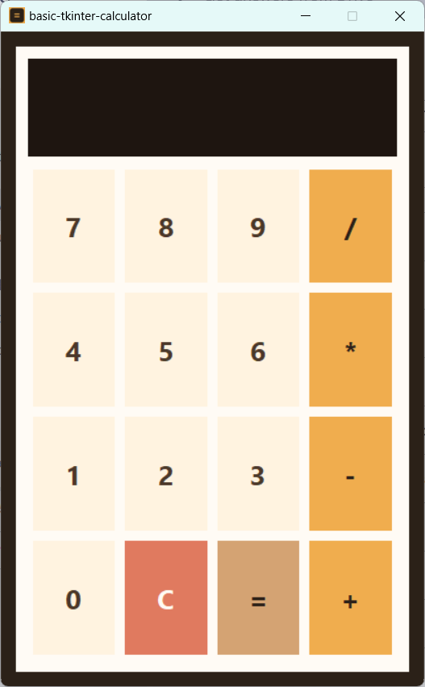

<p align="center">
  
</p>

<h1 align="center">basic-tkinter-calculator</h1>

<p align="center">
  <a href="https://github.com/Rayfel2/BasicTkinterCalculator/actions/workflows/ci.yml"></a>
  <a href="https://github.com/Rayfel2/BasicTkinterCalculator/actions/workflows/cd-vercel.yml"></a>
  <a href="https://www.python.org/"></a>
  <a href="https://opensource.org/licenses/MIT"></a>
</p>

<p align="center">
  Calculadora dual: una aplicación de escritorio desarrollada con <strong>Tkinter</strong> y una calculadora web construida con <strong>Flask</strong>. Ambas permiten realizar operaciones matemáticas básicas de forma sencilla.
</p>

## Características

- **Calculadora de Escritorio (Tkinter):** Interfaz gráfica nativa, liviana y sin dependencias externas para ejecutar (una vez empaquetada).
- **Calculadora Web (Flask):** Accesible desde cualquier navegador con una interfaz moderna y responsiva.
- **Lógica Segura:** Evaluación de expresiones matemáticas mediante parser seguro, sin uso de `eval()`.
- **Tests Automatizados:** Cobertura de pruebas unitarias para la lógica de negocio y la aplicación web.

## Screenshots

| Escritorio | Web |
|---|---|
|  |  |

## Tecnologías

- [Python](https://www.python.org/)
- [Tkinter](https://docs.python.org/3/library/tkinter.html) (GUI de escritorio)
- [Flask](https://flask.palletsprojects.com/) (Microframework web)
- [PyInstaller](https://pyinstaller.org/) (Empaquetado del ejecutable)

## Instalación y Uso

### Prerrequisitos

- Python 3.10 o superior.
- pip (gestor de paquetes de Python).

### Clonar el repositorio

```bash
git clone https://github.com/Rayfel2/BasicTkinterCalculator.git
cd BasicTkinterCalculator
```

### Instalar dependencias

```bash
pip install -r requirements.txt
```

### Calculadora de Escritorio

```bash
python TkinterCalculadora.py
```

Para generar el ejecutable standalone:

```bash
pyinstaller --onefile --windowed TkinterCalculadora.py
# El ejecutable se encuentra en dist/TkinterCalculadora.exe
```

### Calculadora Web

```bash
python app.py
```

Abre tu navegador en `http://127.0.0.1:5000`.

> **Despliegue en producción:** La aplicación web está optimizada para desplegarse en plataformas serverless como [Vercel](https://vercel.com/) o [Render](https://render.com/) mediante un WSGI entrypoint.

## Despliegue

### Web (Vercel)

El proyecto está configurado para desplegarse automáticamente en [Vercel](https://vercel.com/) mediante GitHub Actions.

1. Conecta tu repositorio de GitHub a Vercel.
2. Configura los siguientes **Repository Secrets** en GitHub (`Settings > Secrets and variables > Actions`):
   - `VERCEL_TOKEN`: Tu token de Vercel.
   - `VERCEL_ORG_ID`: El ID de tu organización/personal en Vercel.
   - `VERCEL_PROJECT_ID`: El ID del proyecto en Vercel.
3. Cada `push` a `main` desencadenará el workflow `cd-vercel.yml` y desplegará la aplicación en producción.

> **Nota:** Si prefieres la integración nativa de Vercel con GitHub (sin GitHub Actions), simplemente conecta el repo desde el dashboard de Vercel. El archivo `vercel.json` ya está preparado para ello.

### Ejecutable de Escritorio

El workflow `ci.yml` genera automáticamente un ejecutable `.exe` para Windows usando PyInstaller y lo publica como artifact en cada push a `main`.

## Tests

Ejecuta el conjunto de pruebas unitarias con:

```bash
python -m unittest test_calculator.py
```

Las pruebas validan:
- La lógica aritmética de ambas calculadoras.
- El manejo de errores (división por cero, sintaxis inválida).
- Las rutas y respuestas HTTP de la aplicación Flask.

## Contribuidores

- Rayfel Ogando ([@Rayfel2](https://github.com/Rayfel2))
- Eladio Tavarez ([@Eventr077](https://github.com/Eventr077))
- Diego Rodriguez ([@D1egoSebastian](https://github.com/D1egoSebastian))
- Axel Felix ([@Notengonombredisponible](https://github.com/Notengonombredisponible))
- Andres Taveras ([@FandresT101](https://github.com/FandresT101))
- Angel Soriano ([@LoyaKnight](https://github.com/LoyaKnight))

## Licencia

Este proyecto está licenciado bajo la [MIT License](LICENSE).
